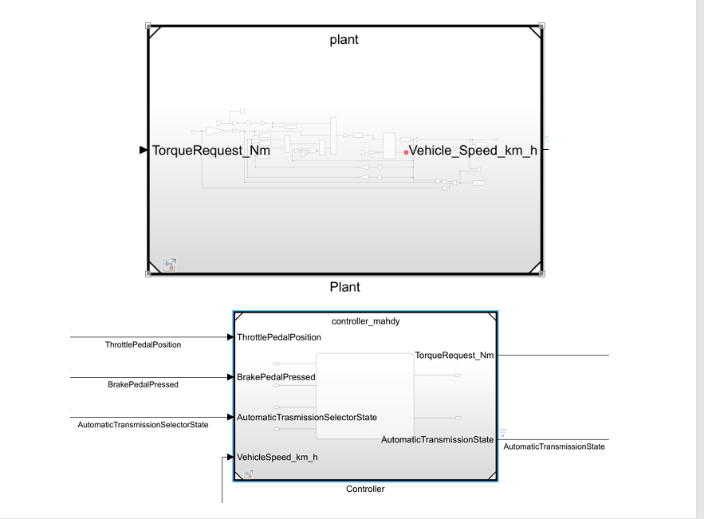

# # One-Pedal Controller

Model-based design, functional-safety analysis, simulation, testing, and embedded deployment of a **one-pedal controller for an electric vehicle**.

The project was developed for the **Model-Based Software Design** course at **Politecnico di Torino**, A.Y. 2024/25.

The work follows a complete model-based development workflow: from item definition and Hazard Analysis and Risk Assessment (HARA), through Simulink/Stateflow controller development and vehicle simulation, to functional-safety mechanisms, software testing, automatic C-code generation, and deployment on a simulated Arduino Uno using SimulIDE.

## Project Overview

The controller allows the driver to request both **traction torque** and **regenerative-braking torque** using a single accelerator pedal.

Two main driving behaviors are considered:

- **Drive mode (D):** the accelerator pedal requests positive traction torque.
- **Brake / One-Pedal mode (B):** the pedal travel is divided into regenerative-braking and acceleration regions.

In B mode, approximately the first third of the pedal travel is used for regenerative braking, while the remaining pedal travel requests positive traction torque.

A conventional hydraulic brake pedal is assumed to remain available independently of the one-pedal controller.

### System Architecture

The controller is evaluated in closed loop with a longitudinal vehicle plant and driver/test inputs.



The controller receives information from the throttle pedal, brake pedal, automatic transmission selector, and vehicle-speed feedback.

It generates:

- Requested torque
- Automatic transmission state

The requested torque is applied to the longitudinal vehicle plant, whose resulting vehicle speed is fed back to the controller.

## Development Workflow

```text
Lab 1
Item Definition + HARA
        |
        v
Lab 2
Simulink / Stateflow Controller + Vehicle Plant
        |
        v
Lab 3
Functional Safety + Fault Injection + Testing
        |
        v
Lab 4
Arduino Uno Code Generation + SimulIDE Deployment
